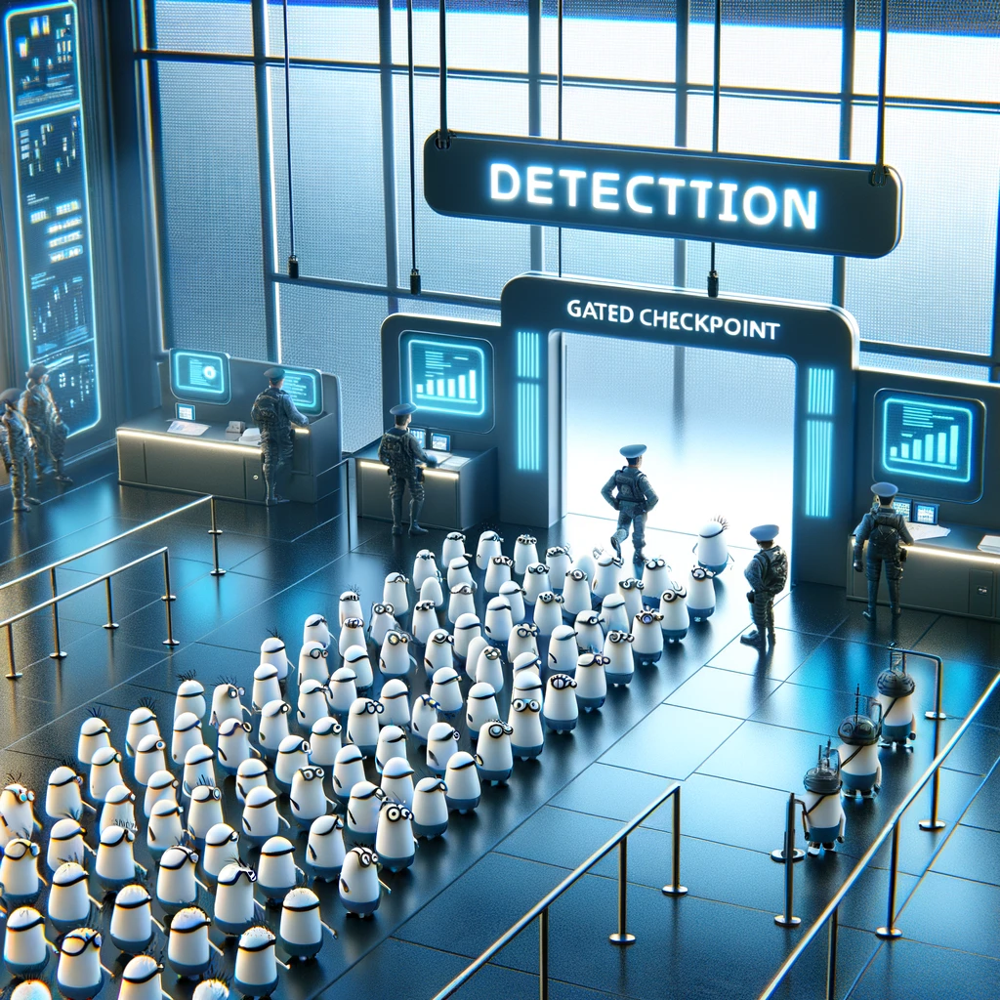

<p align="center">
  
</p>

<br>

<div>
    <a href="https://colab.research.google.com/drive/1cC5CRpuY8-W54FhZdUyD1N7FXPtq9vIE?usp=sharing"></a>
    <a href="https://www.kaggle.com/code/yourUsername/gated-yolo"></a>
</div>
<br>

## Gated YOLO

Implementation of the Gated YOLO architecture introduces a dynamic gating mechanism within the YOLO framework to improve efficiency and performance, particularly on edge devices. This novel adaptation focuses on real-time object detection in dynamic environments, leveraging scene-specific model pruning and dynamic gating to significantly reduce computational load without impacting detection accuracy.

## Quick Start

<details open>
<summary> Install</summary>

```shell
git clone https://github.com/hectorandac/Gated-YOLOv6
cd Gated-YOLOv6
pip install -r requirements.txt
```
</details>

<details>
<summary> Finetune on Custom Data</summary>

Single GPU

```shell
python tools/train.py --batch 32 --conf configs/gated_yolov6s_finetune.py --data data/dataset.yaml --device 0
```

Multi GPUs (DDP mode recommended)

```shell
python -m torch.distributed.launch --nproc_per_node 8 tools/train.py --batch 256 --conf configs/gated_yolov6s_finetune.py --data data/dataset.yaml --device 0,1,2,3,4,5,6,7
```
- conf: select config file to specify network/optimizer/hyperparameters. It's recommended to apply gated_yolov6n/s/m/l_finetune.py when training on your custom dataset.
- data: prepare dataset and specify dataset paths in data.yaml

YOLOv6 supports different input resolution modes. For details, see [How to Set the Input Size](./docs/About_training_size.md).

</details>

<details>
<summary>Resume Training</summary>

If your training process is interrupted, you can resume training by specifying the path to your latest checkpoint:

```shell
python tools/train.py --resume /path/to/your/checkpoint
```
This command will resume from the specified checkpoint.

</details>

<details open>
<summary> Evaluation</summary>

Evaluate model on COCO val2017 dataset with 640×640 resolution

```shell
python tools/eval.py --data data/coco.yaml --batch 32 --weights path/to/your/model.pt --task val
```
- config-file: specify a config file to define all the eval params.

</details>

<details>
<summary>Inference</summary>

Download a pretrained Gated YOLO model or use your trained model for inference.

```shell
python tools/infer.py --weights path/to/your/model.pt --source img.jpg / imgdir / video.mp4
```
To use a local or web camera for inference:

```shell
python tools/infer.py --weights path/to/your/model.pt --webcam --webcam-addr 0
```
`webcam-addr` can be local camera number id or rtsp address.

</details>

<details>
<summary> Deployment</summary>

*  [ONNX](./deploy/ONNX)
*  [TensorRT](./deploy/TensorRT)
</details>

<details open>
<summary> Tutorials</summary>

*  [Train Custom Data](./docs/Train_custom_data.md)
*  [Test Speed](./docs/Test_speed.md)

</details>

### [FAQ (Continuously updated)](https://github.com/yourGitHub/GatedYOLO/wiki/FAQ-(Continuously-updated))

For any questions or discussions, feel free to open an issue on GitHub.
```